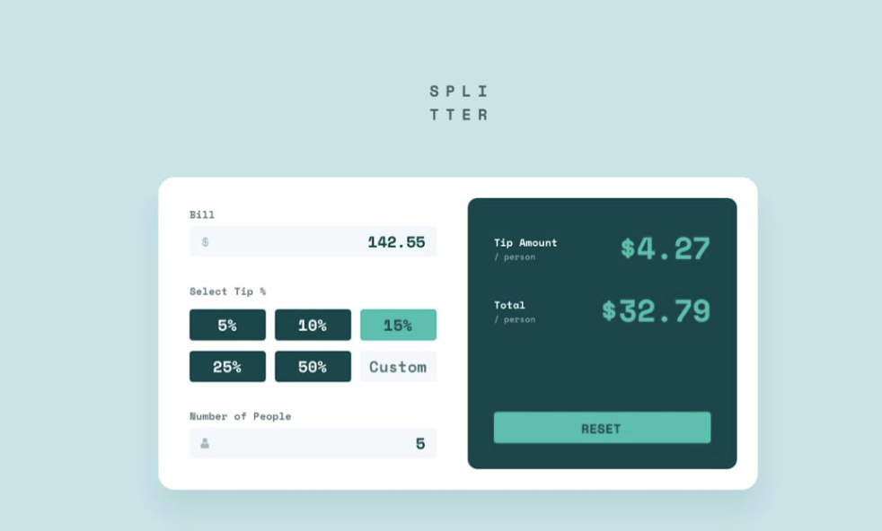

# Tip Calculator


The Tip Calculator is a project inspired by a prompt from Frontend Mentor. Initially created before learning JavaScript, it was designed to replicate a tip calculator's visual design and functionality.

After gaining more knowledge, I revisited the project to enhance my skills. I made the design responsive for mobile devices and started implementing the calculator's functionality through JavaScript, although it's a work in progress.

## Features

- Responsive design for mobile devices.
- Ongoing development of a working tip calculator.

## Getting Started

To view the project:

1. Clone or download this repository to your local machine:

```bash
git clone https://github.com/your-username/tip-calculator.git
```
2. Open the index.html file in your web browser

## Usage
1. Enter the bill amount.
2. Select the desired tip percentage.
3. The calculator will display the tip amount and the total bill, including the tip.

## Technologies Used
- HTML
- CSS
- JavaScript (work in progress)

## Acknowledgements
Frontend Mentor provided the initial project prompt, which inspired this project and my ongoing learning journey.

## Contact Me
If you have any questions, comments, or suggestions, please don't hesitate to reach out. I'd love to hear from you!

**Chaley Boatmon**
- Email: **<u>chaleyboatmon@gmail.com</u>**
- GitHub: [<u>**chayboats**</u>](https://github.com/chayboats)
  
Thank you for visiting my repository!